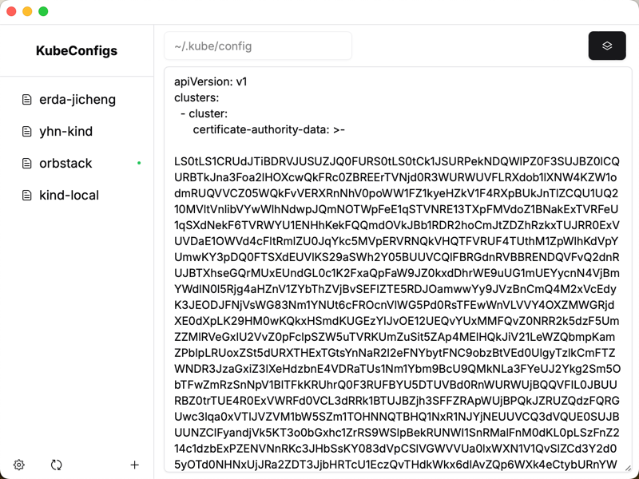
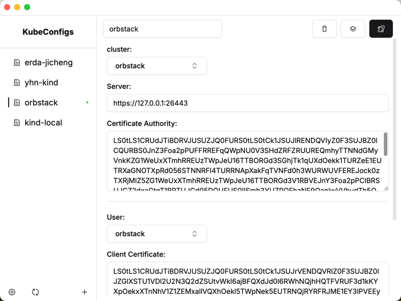
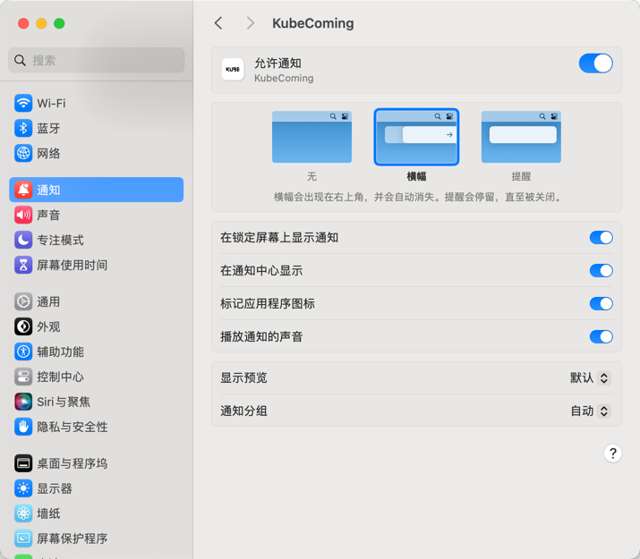

### KubeComing

[简体中文](docs/README_CN.md)

## Installation

You can download from [Github Release](https://github.com/CeerDecy/KubeComing/releases)

## Introduction

KubeComing is a tool designed to simplify the management of your Kubernetes configuration files (KubeConfig). With its
user-friendly visual interface, you can easily manage multiple contexts and switch between them quickly using keyboard
shortcuts.

## Features

- **Visual Interface**: Manage your KubeConfig files through an intuitive graphical user interface.
- **Quick Context Switching**: Use keyboard shortcuts to switch between Kubernetes contexts quickly.

## Shortcuts

Currently, the shortcuts only support F1 to F12, but this does not mean that the number of contexts is limited to 12. The shortcuts will be mapped according to the order of the contexts.

| Shortcuts         | Context Index |
|-------------------|---------------|
| Command+Shift+F1  | 0             |
| Command+Shift+F2  | 1             |
| Command+Shift+F3  | 2             |
| ...               | ...           |
| Command+Shift+F12 | 11            |

## Tips

Enable notifications in the system notification settings to display notifications when switching contexts using shortcuts.

## License

This project is licensed under the MIT License. See the [LICENSE](LICENSE) file for more information.