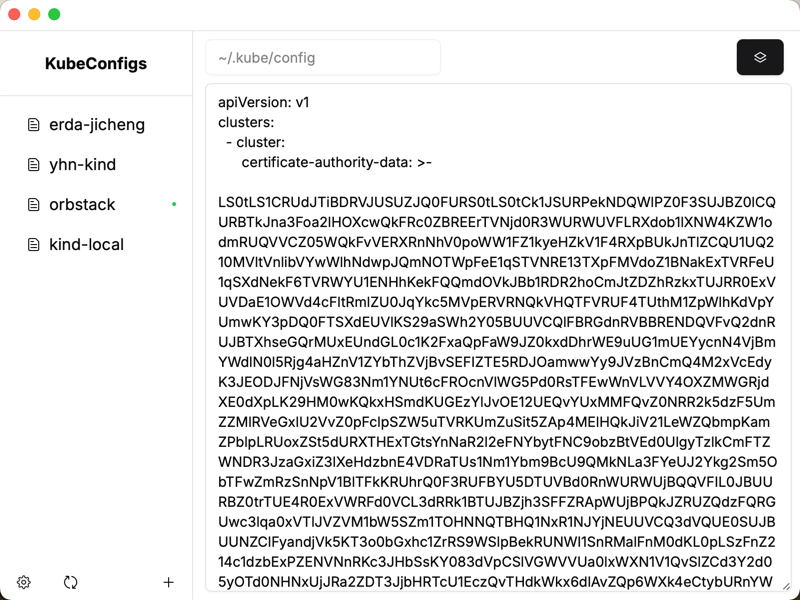
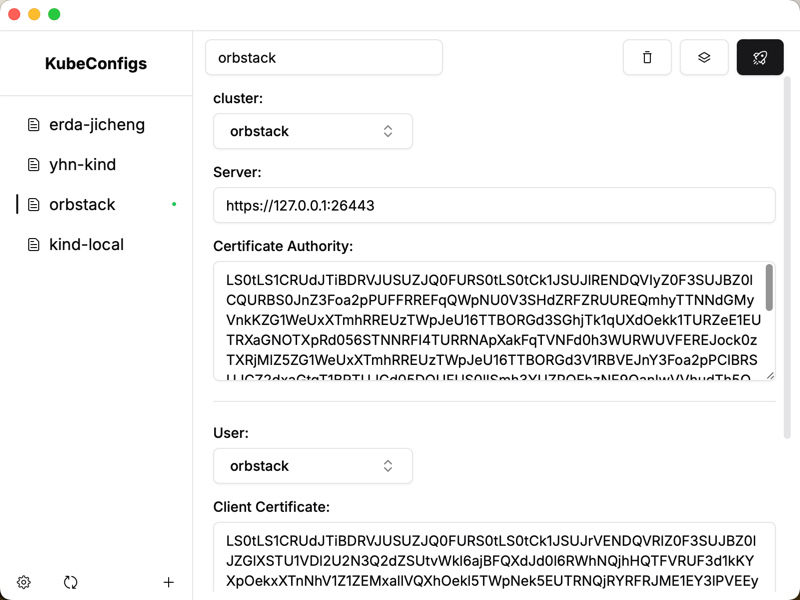
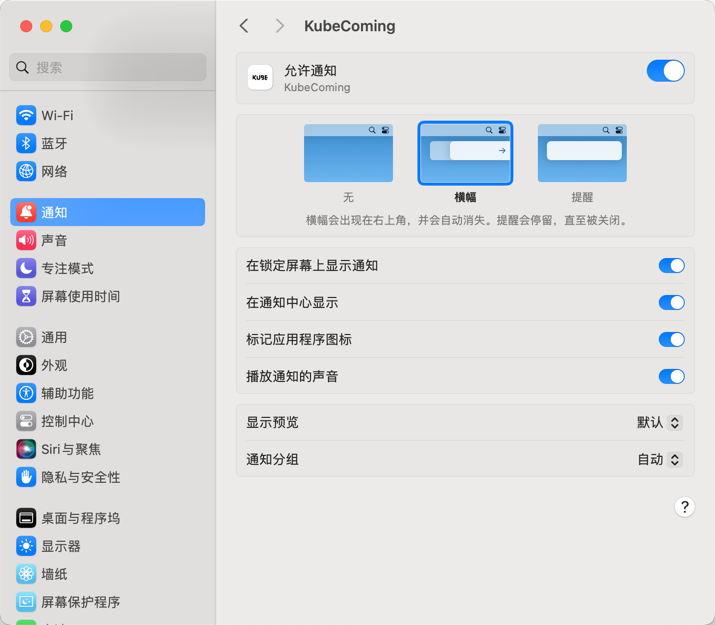

### KubeComing

[English](../README.md)

## 安装

你可以从 [Github Release](https://github.com/CeerDecy/KubeComing/releases) 下载。

## 简介

KubeComing 是一款旨在简化 Kubernetes 配置文件（KubeConfig）管理的工具。通过其用户友好的可视化界面，您可以轻松管理多个上下文，并使用快捷键快速切换。

## 功能

- **可视化界面**：通过直观的图形用户界面管理您的 KubeConfig 文件。
- **快速切换上下文**：使用快捷键快速在 Kubernetes 上下文之间切换。

## 快捷键

目前，快捷键仅支持 F1 至 F12，但这并不意味着Context的数量最多只能有 12 个。快捷键将根据Context的顺序进行映射。

| 快捷键               | Context索引下标 |
|-------------------|-------------|
| Command+Shift+F1  | 0           |
| Command+Shift+F2  | 1           |
| Command+Shift+F3  | 2           |
| ...               | ...         |
| Command+Shift+F12 | 11          |

## 提示

在系统通知设置中将允许通知打开，即可在使用快捷键切换上下文时显示通知。

## 许可证

此项目遵循 MIT 许可证。更多信息请参阅 [LICENSE](../LICENSE) 文件。